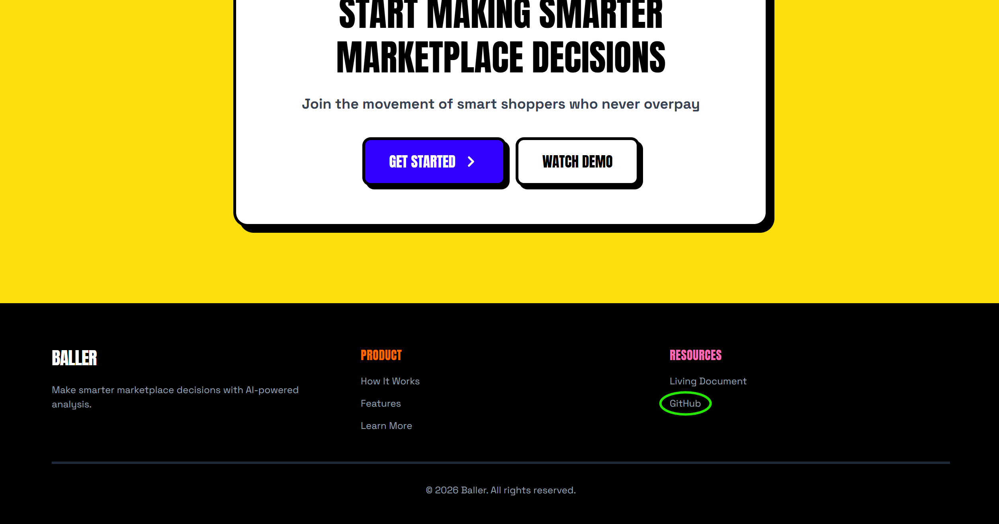

# User Documentation

## Description

Baller is a web-based tool that helps you make smarter and safer purchasing decisions on peer-to-peer marketplaces. When you’re browsing listings, you often are forced to make quick decisions on limited information, making it hard to tell if the product is fairly priced or even legitimate. Baller's objective is to reduce that uncertainty for every user on these marketplaces. By analyzing a listing and comparing it with similar items across platforms, our goal is to provide accurate market data and offer users a sense of relief when scrolling through listings. Using the data that we find in your listing and on the market, Baller gives users an estimate on item condition, recommends an offer based on current market trends, and highlights potential scam indicators, allowing users to search freely and without worry.

## Getting Started

### What you need

To use Baller, you only need:

* A web browser

* A listing URL from a supported marketplace (copied from your browser’s address bar)

### Steps

1. Open the Baller web app: https://baller-jade.vercel.app/

2. Open the listing you want to analyze in a new tab.

3. Copy the browser URL from the address bar.
Note: This is different from the platform’s Share link. Use the image below as a reference.

4. Paste the URL into Baller and click Search.

5. If users want to paste in more than one listing, they must create an account.

### Creating an account (optional)

You can create an account with Baller to keep a record of your **25 most recent listing analysis queries**, ensuring your history is never lost. Your dashboard will automatically save these searches, making it easy to revisit and compare listings that have caught your interest. You will need to provide an email and create a password. Ensure that you verify your email with the code sent to your inbox before logging in with your credentials. 

## Baller Basics

When building Baller, our goal was to keep it as simple as possible for every user. Follow the steps below to analyze a listing and understand your results.

### How to Use Baller

1. Paste a listing browser URL into Baller’s search bar.

2. Click search to load your listings analysis.

3. Review the listing details shown on the dashboard to confirm Baller analyzed the correct item.

### Understanding Your Dashboard

- **Suggested Offer**: A recommended price generated by our model that's both fair and competitive.

- **Model Accuracy**: How confident Baller is about the suggested offer we gave you. This is based on factors like the listing age, the number of photos the listing has, and the description length. 

- **Market Value**: Baller’s estimate of what the item is worth, based on various factors including condition and age.

- **Why this price?**: The explanation section that briefly describes why Baller suggested this offer, allowing for users to give these reasons to the seller.

- **Negotiation Tip**: A negotation tip that allows users quick advice on counter-offers and potential back-and-forth conversations.

- **Similar Listings**: Review the comparable items Baller used to make its estimate. Each listing includes a link so you can verify prices and see alternatives.

- **Scam Detection**: Ranks the listing as low, medium or high scam risk level. This is determined by factors such as how realistic the photos are (for example, high scam risk are watermarked photos), fair pricing (high scam risk are suspiciously low prices), and detailed descriptions. 

With these easy to follow steps, Baller lets you evaluate listings faster, make better offers, and shop with confidence.

## Report an Issue

Since Baller is open-source, we want reporting issues to be quick and easy. If you run into a bug or unexpected behavior, follow the steps below to help our developers reproduce and fix it as fast as possible.

### How to Report an Issue

1. Go to the Baller home page.

2. Scroll to the Resources section at the bottom of the site.

3. Click GitHub, then navigate to Issues.

4. Select **[New Issue](https://github.com/tanner-pham/Baller/issues)** or choose from our [issue templates](https://github.com/tanner-pham/Baller/tree/main/.github/ISSUE_TEMPLATE).

5. Describe the issue in as much detail as possible (include steps to reproduce, what you expected, and what actually happened).

6. Attach screenshots, videos, or logs if they help.

7. Add the bug label (or choose the bug template listed below).

8. Submit the issue and the team will take it from there.

We aim to respond as soon as possible so we can triage and assign the issue quickly. Thanks for helping improve Baller!

## Known Issues

1. Login can fail for some newly created accounts.

2. Free items are not parsed effectively by the model.

3. Listings with no images (or only a video) can cause model errors.

4. The model can time out when a listing takes too long to analyze.